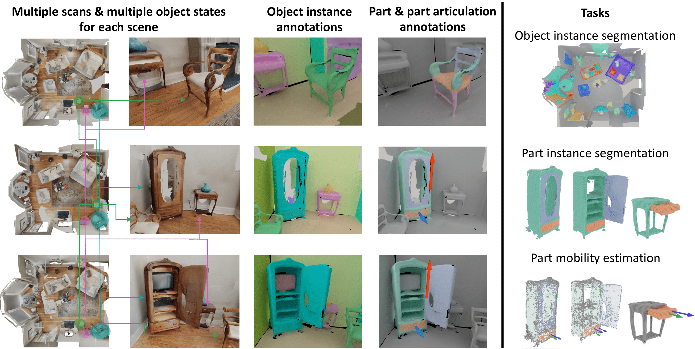

---
hide:
  - navigation
---

# CS479: Machine Learning for 3D Data

<h3><b>
<a href="http://mhsung.github.io/" target="_blank">Minhyuk Sung</a>, <a href="https://www.kaist.ac.kr/" target="_blank">KAIST</a>, Spring 2026
</b></h3>

## 3D Segmentation Competition

^^**Midterm Evaluation Submission Due**^^: ==May 2 (Saturday), 23:59 KST==  
^^**Final Submission Due**^^: ==May 9 (Saturday), 23:59 KST==  
^^**Where to submit**^^: ==KLMS==  

### What to Do
In this competition, your task is to train a **3D point cloud object segmentation** model that goes beyond the previous assignment setups. We provide a dataset with **multiple types of input data**, and your goal is to design an architecture that can effectively leverage these inputs to achieve the best segmentation performance.

We provide the dataset and the evaluation protocol, but the **model design is entirely up to you**. Your objective is to investigate and implement an architecture for 3D point cloud object segmentation that makes effective use of the provided input features/modalities.

You are encouraged to explore different design choices, including: 

- point-based, voxel-based, or hybrid representations,
- feature fusion strategies for multiple input types,
- local and global context modeling, and
- efficient encoder-decoder designs for segmentation.

Your models will be evaluated based on segmentation quality (e.g., the evaluation metrics specified below), and you are encouraged to carefully consider your architectural design choices.

Check out the [Recommended Readings](#recommended-readings) section section, but you are _not_ limited to the architectures introduced there; they are provided only as references.

**==Important Notes==**

^^PLEASE READ THE FOLLOWING CAREFULLY! Any violation of the rules or failure to properly cite existing code, models, or papers used in the project in your write-up will result in a zero score.^^

- **DO NOT** use any pretrained models.
- **DO NOT** exceed a total of 100M model parameters.
- **DO NOT** use any extra training data other than the provided training split.
- **DO NOT** modify the provided evaluation script.
- **DO NOT** use other CUDA version.
- Your code (training, post-processing, and evaluation) must run in the provided **KCLOUD environment within 24 GB of GPU memory (VRAM)**.
- You are allowed to use open-source implementations, as long as they are clearly mentioned and cited in your write-up.

### Dataset and Base Code

You are required to use the **MultiScan** benchmark dataset for training and evaluation. 

{ width=97.5% }[^1]

[^1]: Image from the MultiScan GitHub repository (https://github.com/smartscenes/multiscan). 

Please follow the instructions in the original GitHub repository (see the **"Object Instance Segmentation"** section) and download the datasets from the link below:

[Repository](https://github.com/smartscenes/multiscan/blob/main/dataset/README.md){:target="_blank" .md-button}

**Please note that downloading the datasets may take some time, so we recommend preparing them as early as possible.**

### Evaluation

- We will evaluate 2 tasks: object semantic segmentation (50%) / object instance segmentation (50%). Our evaluation code will measure below metrics based on 17 object categories (`door`, `table`, `chair`, `cabinet`, `window`, `sofa`, `microwave`, `pillow`, `tv_monitor`, `curtain`, `trash_can`, `suitcase`, `sink`, `backpack`, `bed`, `refrigerator`, `toilet`), and for each task the score will be calculated as follows. Please see the details of evaluation code.

- Semantic Segmentation: `mean IoU` over categories.
- Instance Segmentation: `mean AP(0.8 * mAP(0.50:0.95) + 0.2 * mAP(0.25))` over categories.

- The TAs will provide scores computed using the implementation from the repository as reference values. You are expected to match or surpass these reference numbers.

- Additionally, to help everyone gauge progress, there will be a [Midterm Evaluation](#midterm-evaluation-submission-optional)  where teams can submit intermediate results. **Participation is optional**, but the top-k teams at each task in the midterm evaluation that also outperform the TAs’ scores will receive **bonus credit** toward the final grade. All submitted results will be shared anonymously with the class so that teams can see how others are performing.

- **Final grading will be determined relative to the best score achieved for each task.** Specifically, the score for each task is calculated as follows:

    $$
    \mathrm{Score} = \cfrac{\mathrm{Your\,Score}}{\mathrm{Highest\,Score}} \times 8
    $$

    - When Your Score = Highest Score, you get 8 points for that task.

- Bonus credits per task:
    - **Midterm Evaluation Bonus**: Every team that ties or outperforms the reference score on the midterm evaluation will receive +1.0 point (for that task).
    - **Winner Bonus**: If your team achieves the highest score for the Task, you receive +1.0 point (for that task).

- In total, the 3D segmentation competition is worth a maximum of 20 points.

### Midterm Evaluation Submission (Optional)
The purpose of the midterm evaluation is to give all students a reference point for how other teams are progressing. **Participation is optional**, but the top-k teams at each task in the midterm evaluation that also outperform the reference scores will receive **bonus credit** toward the final grade.

- **What to submit**
    1. **Self-contained source code** 
        - Your submission must include the complete codebase necessary to run end-to-end from the TAs' side.
        - TAs will run your code in their environment without additional modifications.
        - For consistent evaluation, the file `evaluation.py` will be replaced with the official version.
    2. **A model checkpoint and config json file**  
- **Grading Procedure**
    - TAs will run your submitted code in their Python environment.
    - The scores measured by TAs will be published on the leaderboard.
    - Submissions that fail to run in the TA environment will be marked as failed on the leaderboard.
    - Among the submissions exceeding the TAs' result, the top-k will earn bonus credit.  

### Final Submission
- **What to submit**:
    1. **Self-contained source code** 
    2. **A model checkpoint and config json file**  
    3. **2-page write-up**.
        - No template provided.  
        - Maximum of two A4 pages, excluding references.  
        - All of the following must be included:
            - **Technical details**: One-paragraph description of the technical details of your implementation, including architecture design, hyper-parameters, etc.
            - **Training details**: Training logs (e.g., training loss curves), and total training time.
            - **Qualitative evidence**: ~4 sample rendered images with segmentation results.  
            - **Citations**: All external code, and papers used must be properly cited.
        - ^^Missing any of these items will result in a penalty.^^
        - ^^If the write-up exceeds two pages, any content beyond the second page will be ignored, which may lead to missing required items.^^

### Grading
^^**There is no late day. Submit on time.**^^  
**Late submission**: ==Zero score==.  
**Missing any required item in the final submission (samples, code/model, write-up)**: ==Zero score==.  
**Missing items in the write-up**: ==10% penalty for each==.  

### Recommended Readings
[1]  [Mao et al., MultiScan: Scalable RGBD scanning for 3D environments with articulated objects, NeurIPS 2022.](https://proceedings.neurips.cc/paper_files/paper/2022/hash/3b3a83a5d86e1d424daefed43d998079-Abstract-Conference.html){:target="_blank"} [[Github]](https://github.com/smartscenes/multiscan){:target="_blank"}[[Benchmark Docs]](https://3dlg-hcvc.github.io/multiscan/read-the-docs/benchmark/dataset.html#object-instance-segmentation){:target="_blank"}  
[2]  [Jiang et al., PointGroup: Dual-Set Point Grouping for 3D Instance Segmentation, CVPR 2020.](https://arxiv.org/abs/2310.02279){:target="_blank"}  
[3]  [Liang et al., Instance Segmentation in 3D Scenes using Semantic Superpoint Tree Networks, ICCV 2021.](https://arxiv.org/abs/2209.03003){:target="_blank"}  
[4]  [Chen et al., Hierarchical Aggregation for 3D Instance Segmentation, ICCV 2021.](https://arxiv.org/abs/2410.12557){:target="_blank"}

 

[Back to top](#)
 

