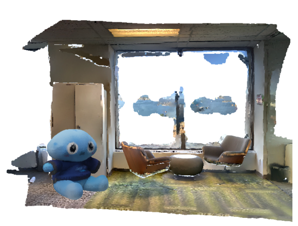

---
hide:
  - navigation
---

# CS479: Machine Learning for 3D Data

<h3><b>
<a href="http://mhsung.github.io/" target="_blank">Minhyuk Sung</a>, <a href="https://www.kaist.ac.kr/" target="_blank">KAIST</a>, Spring 2026
</b></h3>

## 3D Segmentation Competition

^^**Mid-Term Evaluation Submission Due**^^: ==April 30 (Thursday), 23:59 KST==  
^^**Final Submission Due**^^: ==May 9 (Saturday), 23:59 KST==  
^^**Where to submit**^^: ==KLMS==  

{ width=60% }

## What to Do — Find Nubzukis!

In this competition, your mission is to detect and segment **Nubzukis** in 3D scenes. You'll need to train a 3D segmentation neural network that takes a point cloud with color information as input and predicts indices of points for one or multiple instances of Nubzukis. It is a **single-category 3D point cloud instance segmentation** task.

Check out the repository in the following link for  

- the base code
- the evaluation code
- the required format of your outputs
- the details of the evaluation

[Base Code Repository]({{links.seg_repo}}){:target="_blank" .md-button}

For your implementation, start from the base code provided in the link above. You are free to modify any files other than the official `evaluate.py`, as long as your final submission runs end-to-end in the TA environment.

Also, check out the [Recommended Readings](#recommended-readings) section for references to 3D segmentation networks, but you are _not_ limited to the architectures introduced there; they are provided only as references.

**Important Notes**

PLEASE READ THE FOLLOWING CAREFULLY! Any violation of the rules, or failure to properly cite any existing code, models, or papers used in the project write-up, will result in a zero score.

### What you CANNOT do

- ❌ **DO NOT** use any pretrained networks.
- ❌ **DO NOT** exceed the total model parameter limit (50M).
- ❌ **DO NOT** use any extra datasets for training other than the provided training split (`train`, `val`) and reference objects (`sample.glb`).
- ❌ **DO NOT** modify the provided `evaluate.py` for the official submission.
- ❌ **DO NOT** use any CUDA version other than the provided one (default: 12.4).
- ❌ **DO NOT** exceed the main inference loop time limit (300 seconds).
- ❌ **DO NOT** exceed the VRAM limit (24GB).

### What you CAN do

- ✅ **Modify `model.py`** to implement your own model.
- ✅ **Implement your own dataset loader** based on the MultiScan dataset and the provided reference objects.
- ✅ **Implement your own training pipeline** to train your model.
- ✅ **Create new files** as needed for your implementation.
- ✅ **Use open-source implementations**, as long as they are clearly acknowledged and properly cited in your write-up.
- ✅ **Use extra libraries**: If your implementation requires an additional library, please post the library name and a brief justification in the Slack `#questions` channel. The TAs will review each request and approve or reject it. Only approved libraries may be used.

## MultiScan Dataset

At test time, scenes from the [**MultiScan dataset**](https://3dlg-hcvc.github.io/multiscan/){:target="_blank"} with one or more inserted Nubzukis will be used.
Although the test scenes will __not__ be provided, you may use the training data from MultiScan, and we also provide the Nubzuki 3D object file as a `.glb` file.

Download both the **Multiscan dataset** and the **Nubzuki** 3D object from the following link:

[Data Download Link]({{links.seg_data}}){:target="_blank" .md-button}

The Multiscan dataset provided in the above link is the same dataset provided in the official dataset website.
You may use the provided train and val splits for training and validation, but you may not use any external dataset or pretrained model.

Each test scene will be generated using the following procedure. For each scene:

- a random number of objects is inserted (`min=1`, `max=5`)
- mesh placement is attempted with multiple scale ratios (range: `0.025` to `0.2` of the scene diagonal)
- an object may be placed on top of another object, and it may partially overhang.

Once the object is placed, the point cloud is extracted with the following augmentations:

- anisotropic scaling: each of the x-, y-, and z-axes is independently scaled within the range `(0.5, 1.5)`
- affine transform: rotation around the x-, y-, and z-axes in the range `(-180, 180)`
- color map jittering

Note that simulating similar object insertion and augmentation procedures during training is allowed.

## Evaluation

Instance segmentation results are evaluated on the generated test set using two metrics: `F1@0.25`($F1_{0.25}$) and `F1@0.50`($F1_{0.50}$).

For each scene, we first convert the predicted instance labels and ground-truth instance labels into binary instance masks, one mask per object instance.
We then compute the pairwise IoU matrix between all predicted and ground-truth instances.

Using this IoU matrix, we perform Hungarian matching (1-to-1 assignment) with cost $1 - \mathrm{IoU}$. For a given IoU threshold $\tau$, we define:

- $TP_\tau$: the number of matched instance pairs whose IoU is at least $\tau$,
- $FP_\tau$: the number of predicted instances not counted as true positives, and
- $FN_\tau$: the number of ground-truth instances not counted as true positives.

For each threshold, TP, FP, and FN are aggregated over all scenes. Then, the F1 score is computed for all scenes as follows:

$$
\text{F1}_{\tau} = \frac{2 \text{TP}_{\tau}}{2 \text{TP}_{\tau} + \text{FP}_{\tau} + \text{FN}_{\tau}}
$$

The F1 scores with two different thresholds, 0.25 and 0.50, must be reported: `F1@0.25`($F1_{0.25}$) and `F1@0.50`($F1_{0.50}$).

**Note**: Predicted instance IDs must be in the range 1 to 100. Any predicted ID greater than `100` is remapped to background (`0`) before scoring.

More details about the evaluation metric are provided in `evaluate.py`.

- To help everyone gauge progress, there will be a [Mid-Term Evaluation](#mid-term-evaluation-submission-optional) where teams can submit intermediate results.
- **Final grading will be determined relative to the best score achieved for each metric (`F1@0.25` and `F1@0.50`).** Specifically, the score for each metric is computed as follows:

  $$
  \mathrm{Score} = \max\left(\cfrac{\mathrm{Your\,Score}}{\mathrm{Highest\,Score}} \times 8, 0\right)
  $$

- If your score equals the highest score, you receive 8 points for that metric.

- Bonus credits for each metric:
    - **Mid-Term Evaluation Bonus**: Every team that outperforms the TA’s score in the mid-term evaluation receives +1.0 point for that metric.
    - **Winner Bonus**: If your team achieves the highest score for a metric, you receive +1.0 point for that metric.

- In total, the 3D Point Cloud Segmentation Challenge is worth a maximum of 20 points.

## Mid-Term Evaluation Submission (Optional)

The purpose of the mid-term evaluation is to help teams gauge their progress. **Participation is optional**, but the top-k teams for each metric will receive bonus credit toward the final grade.

#### **What to submit**
  1. **Self-contained source code**
      - Your submission must include the complete codebase necessary to run end-to-end in the TA environment.
      - The TAs will run your code in their environment without additional modifications.
      - For consistent evaluation, `evaluate.py` will be replaced with the official version during grading.
  2. **A model checkpoint** (and an optional config file)

- **Grading Procedure**
  - The TAs will run your submitted code in their Python environment.
  - The scores measured by the TAs will be published on the leaderboard.
  - Submissions that fail to run in the TA environment will be marked as failed on the leaderboard.
  - Among the submissions that outperform the TAs’ scores, the top-k teams will receive bonus credit.

### Final Submission

#### **What to submit**
  1. **Self-contained source code**
  2. **A model checkpoint** (optional config file allowed)
  3. **A 2-page write-up**
      - No template is provided.
      - The write-up must be at most two A4 pages, excluding references.
      - All of the following must be included:
          - **Technical details**: A one-paragraph description of your implementation, including the architecture design, hyperparameters, and other relevant details.
          - **Training details**: Training logs (e.g., training loss curves) and the total training time.
          - **Qualitative evidence**: At least four rendered sample images with segmentation results.
          - **Citations**: All external code and papers used must be properly cited.
      - ^^Missing any of these items will result in a penalty.^^
      - ^^If the write-up exceeds two pages, any content beyond page 2 will be ignored, which may cause required items to be missing.^^

### Grading

^^**There are no late days. Submit on time.**^^  

**Late submission**: ==Zero score==.  
**Missing any required item in the final submission (qualitative results, code/checkpoint, or write-up)**: ==Zero score==.  
**Missing items in the write-up**: ==10% penalty for each==. 

### Recommended Readings
[1] [Mao et al., MultiScan: Scalable RGBD scanning for 3D environments with articulated objects, NeurIPS 2022.](https://proceedings.neurips.cc/paper_files/paper/2022/hash/3b3a83a5d86e1d424daefed43d998079-Abstract-Conference.html){:target="_blank"} [[Github]](https://github.com/smartscenes/multiscan){:target="_blank"} [[Benchmark Docs]](https://3dlg-hcvc.github.io/multiscan/read-the-docs/benchmark/dataset.html#object-instance-segmentation){:target="_blank"}  
[2] [Jiang et al., PointGroup: Dual-Set Point Grouping for 3D Instance Segmentation, CVPR 2020.](https://arxiv.org/abs/2004.01658){:target="_blank"}  
[3] [Liang et al., Instance Segmentation in 3D Scenes using Semantic Superpoint Tree Networks, ICCV 2021.](https://arxiv.org/abs/2108.07478){:target="_blank"}  
[4] [Chen et al., Hierarchical Aggregation for 3D Instance Segmentation, ICCV 2021.](https://arxiv.org/abs/2108.02350){:target="_blank"}

 

[Back to top](#)
 
