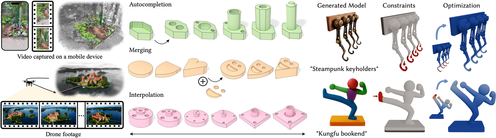

---
hide:
  - navigation
  - toc
---

# [Clément Jambon](https://clementjambon.github.io/){:target="_blank"}
## Bridging the Representation Gap: A Journey Through Editing, Generation, and Simulation
### Ph.D. Student at MIT April 13, 2026 (Mon), 1:00 p.m. KST E3-5 Building, Room 210.

### <b>Guest Lecture at [CS479: Machine Learning for 3D Data](../){:target="_blank"} [Minhyuk Sung](http://mhsung.github.io/){:target="_blank"}, [KAIST](https://www.kaist.ac.kr/){:target="_blank"}, Spring 2026</b>

 
{ width=99% }[^1]

[^1]: Images from ExCellGen (CVM 2026), BrepDiff (SIGGRAPH 2025), and PhysiOpt(SIGGRAPH Asia 2025).  

### **Abstract**
Representations are crucial in computer graphics but cannot escape a fundamental tension: the representation best suited for capturing a scene or an object is rarely the one best suited for downstream applications. Because no single representation serves all needs, I will show multiple attempts at bridging this gap, enabling editing, generation, and simulation.

I will first discuss the limitations of 3D scene representations such as NeRFs and 3D Gaussian Splatting, which remain difficult to manipulate. I will present NeRFshop (I3D 2023) and ExCellGen (CVM 2026), which enable intuitive, real-time editing and generation from real-world exemplar data.

I will then shift focus to generative models. Despite impressive perceptual quality, these models often lack the structural and physical guarantees necessary for objects to function in the real world. I will show how BrepDiff (SIGGRAPH 2025) and PhysiOpt (SIGGRAPH Asia 2025) address these shortcomings by closing the gap between generated and fabrication-ready geometry.

Finally, simulation has long relied on grid-based discretizations that require robust and expensive meshing. Recent grid-free Monte Carlo methods offer a compelling alternative but with weaker convergence guarantees. I will present a novel hybrid PDE solver that bridges these two paradigms while retaining the strengths of each.

### **Bio**
Clément Jambon is a second-year Ph.D. student at MIT CSAIL, where he works in the Algorithmic Design Group under the supervision of Mina Konaković Luković. He received an engineering degree from École Polytechnique in Paris and an M.Sc. in Computer Science from ETH Zurich. He gained research experience as a research intern at Inria, a research intern at NVIDIA Research, and a visiting student at the 3D Vision Lab of Seoul National University. He is currently a Siebel Scholar in the Class of 2026. His current research interests are physically-based simulation, generative modeling, Monte Carlo methods, and PDEs.

 

