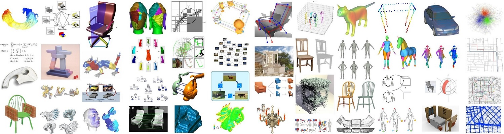

---
hide:
  - navigation
  - toc
---

# [Qixing Huang](https://www.cs.utexas.edu/~huangqx/){:target="_blank"}
## Geometric Regularizations for 3D Shape Generation
### Associate Professor at The University of Texas at Austin April 15, 2026 (Wed), 1:00 p.m. KST E3-5 Building, Room 210.

### <b>Guest Lecture at [CS479: Machine Learning for 3D Data](../){:target="_blank"} [Minhyuk Sung](http://mhsung.github.io/){:target="_blank"}, [KAIST](https://www.kaist.ac.kr/){:target="_blank"}, Spring 2026</b>

 
{ width=99% }[^1]

[^1]: Image from https://www.cs.utexas.edu/~huangqx/research.html.  

### **Abstract**
Generative models, which map a latent parameter space to instances in an ambient space, enjoy various applications in 3D Vision and related domains. A standard scheme of these models is probabilistic, which aligns the induced ambient distribution of a generative model from a prior distribution of the latent space with the empirical ambient distribution of training instances. While this paradigm has proven to be quite successful on images, its current applications in 3D generation encounter fundamental challenges in the limited training data and generalization behavior. The key difference between image generation and shape generation is that 3D shapes possess various priors in geometry, topology, and physical properties. Existing probabilistic 3D generative approaches do not preserve these desired properties, resulting in synthesized shapes with various types of distortions. In this talk, I will discuss recent work that seeks to establish a novel geometric framework for learning shape generators. The key idea is to model various geometric, physical, and topological priors of 3D shapes as suitable regularization losses by developing computational tools in differential geometry and computational topology. We will discuss the applications in deformable shape generation, latent space design, joint shape matching, 3D man-made shape generation, and novel-view synthesis.

### **Bio**
Qixing Huang is an associate professor with tenure and the director of the visual computing center (in preparation) at the computer science department of the University of Texas at Austin. His research sits at the intersection of graphics, geometry, optimization, vision, and machine learning. He has published more than 150 papers at leading venues across these areas. His research has received several awards, including multiple best paper awards, the best dataset award at Symposium on Geometry Processing 2018, IJCAI 2019 early career spotlight, and 2021 NSF Career award. His recent research is supported by research awards from Adobe, Google, and Amazon, multiple NSF awards, , He has also served as (senior) area chairs of ICLR, NeurIPS, CVPR, ECCV, ICCV and sorting and technical papers committees of SIGGRAPH and SIGGRAPH Asia, and co-chaired Symposium on Geometry Processing 2020.

 

