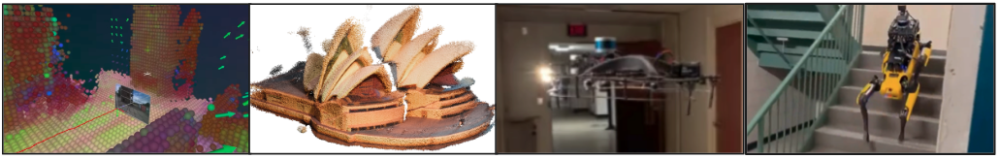

---
hide:
  - navigation
  - toc
---

# [Seungchan Kim](https://seungchan-kim.github.io/){:target="_blank"}
## 3D Representations for Robotics: Geometry, Efficiency, and Semantics  
### Ph.D. candidate at Carnegie Mellon University May 27, 2026 (Wed), 1:00 p.m. KST Zoom.

[Zoom Link](https://kaist.zoom.us/j/81229648666){:target="_blank" .md-button}

### <b>Guest Lecture at [CS479: Machine Learning for 3D Data](../){:target="_blank"} [Minhyuk Sung](http://mhsung.github.io/){:target="_blank"}, [KAIST](https://www.kaist.ac.kr/){:target="_blank"}, Spring 2026</b>

 
{ width=99% }

### **Abstract**
As robots are increasingly deployed in complex, unstructured environments, the question of how to represent the 3D world becomes central. This lecture explores what makes a 3D representation useful for robotics — and argues that geometry, efficiency, and semantics are the three axes that matter most.

We begin with the robotics motivation: how semantic 3D understanding enables real-world tasks such as navigation and mapping. From there, we examine recent advances in feed-forward reconstruction of 3D scene geometry, and how these representations can be made efficient enough for real-time deployment. Finally, we return to semantics, discussing how language and perception can be grounded in 3D space to support downstream robotic tasks, and how efficiency and semantics can be jointly achieved.

We close with an outlook on open problems: how 3D representations might serve as intermediate layers in end-to-end robotic pipelines, what world models could offer in extending 3D representations beyond static observations, and where manipulation fits into this picture — a domain where the role of 3D remains an open and exciting question.

### **Bio**
Seungchan Kim is a Ph.D. Candidate in Robotics at Carnegie Mellon University, advised by Professor Sebastian Scherer. He received his Bachelor of Science in Applied Mathematics & Computer Science, and Master of Science in Computer Science, from Brown University. His research focuses on spatial reasoning and semantic representations for mobile robot autonomy. His work has appeared in venues such as ICRA, IROS, RSS, RA-L, TRO, CVPR, and ECCV.
 
 

